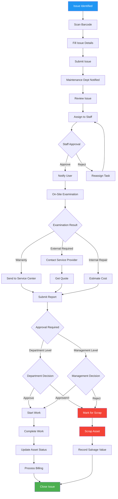

# Maintenance Department Workflow Diagram

## Process Flow Visualization

## Decision Points

### Priority Levels
- **Urgent**: Red - Immediate action required
- **Serious**: Orange - Action within 1 hour
- **Normal**: Green - Action within 4 hours

### Approval Levels
- **Department Level**: Costs within departmental budget
- **Management Level**: Costs exceeding departmental authority

### Resolution Paths
- **Internal Repair**: Handled by maintenance staff
- **External Service**: Outsourced to service providers
- **Warranty Service**: Handled by authorized service centers
- **Asset Scrapping**: When repair is not cost-effective

## Key Metrics

### Response Times
- Issue Acknowledgment: < 1 hour
- Assignment: < 4 hours
- On-site Visit: 24-48 hours

### Quality Targets
- First-time Fix Rate: > 85%
- Customer Satisfaction: > 90%
- Cost Accuracy: ±10%

## Escalation Paths

## Integration Points

### System Integration
- Asset Management System
- Calendar/Scheduling System
- Billing System
- Notification System
- Document Management

### External Systems
- Service Provider Portals
- Warranty Management Systems
- Inventory Management
- Financial Systems

---

*This diagram should be rendered using a Mermaid-compatible viewer for full visualization.*
