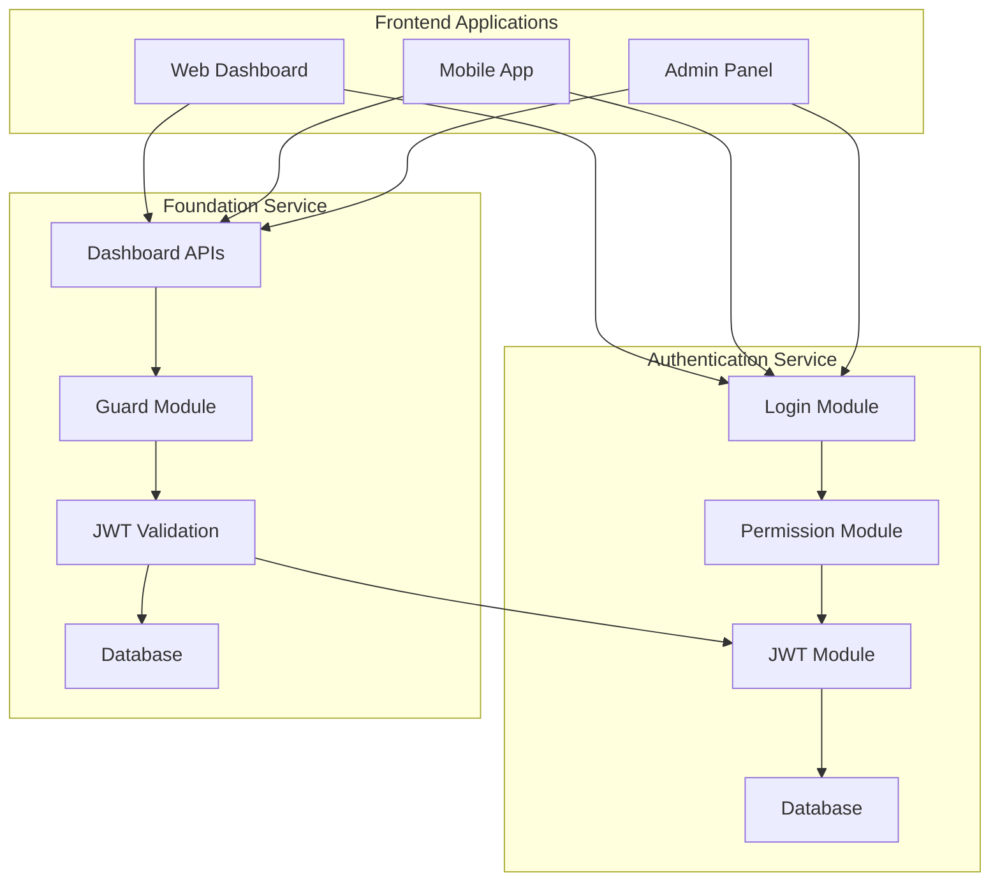
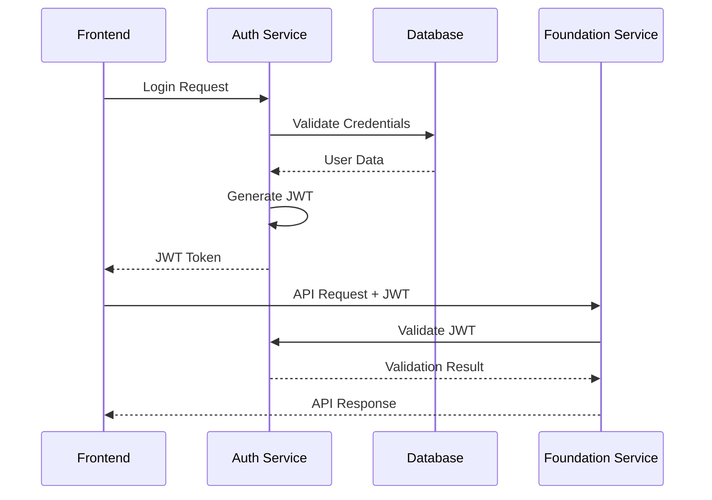
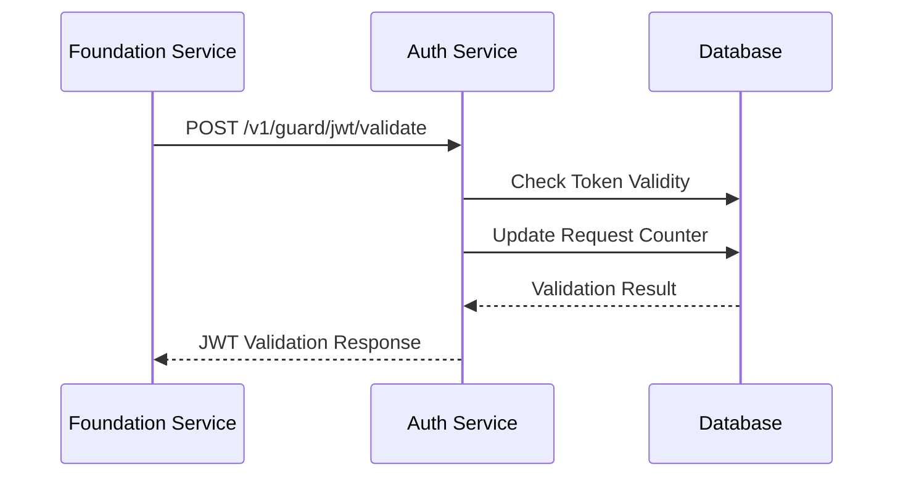
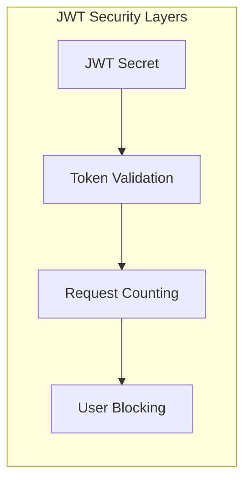

# JWT Authentication System - Architecture

## 🏗️ **System Architecture Overview**

The JWT authentication system implements a **centralized security architecture** with two main services working together to provide secure, scalable authentication.



## 🔐 **Authentication Service Architecture**

### **Service Structure:**
```
authentication/
├── connection/              # Database connections
├── routes/                  # Route configuration
└── v1/                      # API version 1
    ├── login/               # User authentication
    ├── permission/          # User permissions
    └── guard/jwt/           # JWT security operations
```

### **Module Responsibilities:**

#### **1. Login Module** (`authentication/v1/login/`)
- **Purpose**: Handle user authentication and login
- **Key Functions**:
  - Validate user credentials
  - Generate JWT tokens
  - Handle login/logout operations
- **Endpoints**:
  - `POST /v1/authentication/login`
  - `POST /v1/authentication/logout`

#### **2. Permission Module** (`authentication/v1/permission/`)
- **Purpose**: Manage user permissions and roles
- **Key Functions**:
  - User permission validation
  - Role-based access control
  - User profile management
- **Endpoints**:
  - `GET /v1/permission/me`
  - `GET /v1/permission/user/{id}`

#### **3. JWT Module** (`authentication/v1/guard/jwt/`)
- **Purpose**: Handle JWT token operations and security
- **Key Functions**:
  - JWT token validation
  - Token refresh operations
  - Token revocation
  - Request counting and blocking
- **Endpoints**:
  - `POST /v1/guard/jwt/validate`
  - `POST /v1/guard/jwt/refresh`
  - `POST /v1/guard/jwt/revoke`
  - `GET /v1/guard/jwt/stats`
  - `GET /v1/guard/jwt/blocked-users`

## 🛡️ **Foundation Service Architecture**

### **Service Structure:**
```
foundation/
├── connection/              # Database connections
├── middleware/              # JWT middleware
├── routes/                  # Route configuration
└── v1/                      # API version 1
    ├── dashboard/           # Dashboard functionality
    └── guard/               # Security operations
        ├── guard.module.go  # Guard module wrapper
        └── jwt/             # JWT validation
```

### **Module Responsibilities:**

#### **1. Dashboard Module** (`foundation/v1/dashboard/`)
- **Purpose**: Provide dashboard functionality
- **Key Functions**:
  - Asset management
  - Branch operations
  - Position management
  - Settings management
- **Protection**: All routes protected by JWT middleware

#### **2. Guard Module** (`foundation/v1/guard/`)
- **Purpose**: Handle security and JWT validation
- **Key Functions**:
  - JWT token validation
  - Request counting
  - Security monitoring
- **Endpoints**:
  - `POST /v1/guard/jwt/validate`

## 🔄 **Data Flow Architecture**

### **Authentication Flow:**


### **JWT Validation Flow:**


## 🗄️ **Database Architecture**

### **Authentication Service Database:**
- **Schema**: `authentication`
- **Tables**:
  - `users` - User accounts
  - `jwt_request_counters` - JWT validation tracking
  - `permissions` - User permissions
  - `roles` - User roles

### **Foundation Service Database:**
- **Schema**: `core`
- **Tables**:
  - `assets` - Asset management
  - `branches` - Branch operations
  - `positions` - Position management
  - `settings` - User settings

## 🔧 **Security Architecture**

### **JWT Security Model:**


### **Request Counter System:**
- **Purpose**: Prevent brute force attacks
- **Implementation**: Track failed JWT validations per user
- **Threshold**: Block user after 3 failed attempts
- **Recovery**: Automatic unblocking after timeout

### **Token Management:**
- **Access Tokens**: Short-lived (15 minutes)
- **Refresh Tokens**: Long-lived (7 days)
- **Revocation**: Immediate invalidation
- **Validation**: Real-time verification

## 🚀 **Deployment Architecture**

### **Production Environment:**
```
┌─────────────────────────────────────────────────────────────┐
│                    Production Environment                    │
├─────────────────────────────────────────────────────────────┤
│  Authentication Service: authentication.keeptrack.velonovo.com │
│  Foundation Service:     foundation.keeptrack.velonovo.com   │
│  Database:              Supabase PostgreSQL                  │
│  Load Balancer:        Cloudflare/CDN                       │
└─────────────────────────────────────────────────────────────┘
```

### **Service Communication:**
- **Authentication Service**: Handles all security operations
- **Foundation Service**: Validates JWT tokens for API access
- **Shared JWT Secret**: Both services use same secret for validation
- **Database**: Separate schemas for each service

## 📊 **Monitoring and Observability**

### **JWT Statistics:**
- Token validation counts
- Failed validation attempts
- Blocked user statistics
- Performance metrics

### **Security Monitoring:**
- Request counter tracking
- User blocking events
- Token revocation events
- Authentication failures

## 🔄 **Scalability Considerations**

### **Horizontal Scaling:**
- **Authentication Service**: Stateless, easily scalable
- **Foundation Service**: Stateless, easily scalable
- **Database**: PostgreSQL with connection pooling

### **Performance Optimization:**
- **JWT Validation**: Local validation in Foundation Service
- **Database**: Optimized queries with indexes
- **Caching**: JWT validation results cached
- **Load Balancing**: Multiple service instances

## 🛠️ **Development Architecture**

### **Code Organization:**
- **MVC Pattern**: Model-View-Controller structure
- **Module System**: Independent, reusable modules
- **Dependency Injection**: Clean service dependencies
- **Interface Segregation**: Clear service boundaries

### **Testing Strategy:**
- **Unit Tests**: Individual module testing
- **Integration Tests**: Service communication testing
- **Security Tests**: JWT validation testing
- **Performance Tests**: Load and stress testing