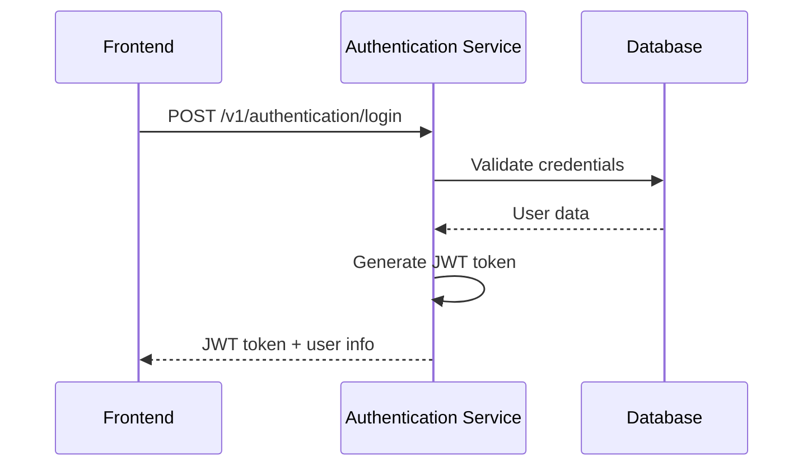
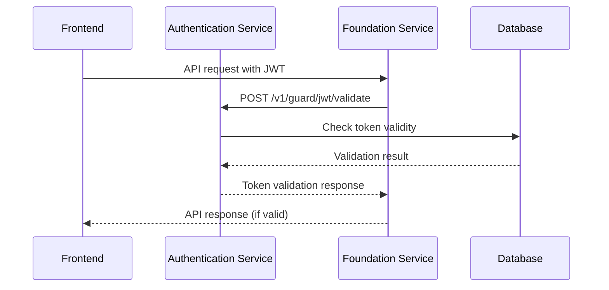

# JWT Authentication System - Summary

## 🏗️ **Current Architecture Overview**

The JWT authentication system is now fully implemented with a **centralized security approach** where the Authentication Service handles all security concerns, while the Foundation Service provides JWT validation for API protection.

### 🔐 **Authentication Service** (`authentication/`)
**Primary Security Hub** - Handles all authentication and security operations

#### **Module Structure:**
```
authentication/v1/
├── login/                    # User login and token generation
├── permission/              # User permissions and role management  
└── guard/jwt/              # JWT validation, refresh, and security
    ├── dto/                # JWT request/response DTOs
    ├── handler/            # JWT HTTP handlers
    ├── models/             # JWT data models
    ├── repository/         # JWT database operations
    └── service/            # JWT business logic
```

#### **Production Endpoints:**
- **Login**: `POST /v1/authentication/login`
- **User Info**: `GET /v1/permission/me`
- **JWT Validation**: `POST /v1/guard/jwt/validate`
- **JWT Refresh**: `POST /v1/guard/jwt/refresh`
- **JWT Revoke**: `POST /v1/guard/jwt/revoke`
- **JWT Stats**: `GET /v1/guard/jwt/stats`
- **Blocked Users**: `GET /v1/guard/jwt/blocked-users`

### 🛡️ **Foundation Service** (`foundation/`)
**API Protection Layer** - Validates JWT tokens for API access

#### **Module Structure:**
```
foundation/v1/
├── dashboard/               # Dashboard functionality
└── guard/                  # Security and JWT validation
    ├── guard.module.go     # Guard module wrapper
    └── jwt/               # JWT validation module
        ├── dto/           # JWT DTOs
        ├── handler/       # JWT handlers
        ├── models/         # JWT models
        ├── repository/     # JWT database operations
        └── service/       # JWT validation logic
```

#### **Production Endpoints:**
- **JWT Validation**: `POST /v1/guard/jwt/validate`
- **Dashboard APIs**: All protected by JWT middleware

## 🔄 **Authentication Flow**

### **1. User Login Process**


### **2. API Request Process**


## 🔧 **Key Features**

### **Authentication Service Features:**
- ✅ **User Login** with credential validation
- ✅ **JWT Token Generation** with secure signing
- ✅ **JWT Validation** with request counting
- ✅ **JWT Refresh** for token renewal
- ✅ **JWT Revocation** for security
- ✅ **Request Counter** to prevent brute force attacks
- ✅ **User Blocking** after failed attempts
- ✅ **Permission Management** for role-based access

### **Foundation Service Features:**
- ✅ **JWT Middleware** protecting all `/v1` routes
- ✅ **Local JWT Validation** for performance
- ✅ **Dashboard API Protection** with JWT
- ✅ **Guard Module** for security operations

## 🚀 **Production URLs**

### **Authentication Service:**
- **Base URL**: `https://authentication.keeptrack.velonovo.com`
- **Login**: `https://authentication.keeptrack.velonovo.com/v1/authentication/login`
- **JWT Validation**: `https://authentication.keeptrack.velonovo.com/v1/guard/jwt/validate`

### **Foundation Service:**
- **Base URL**: `https://foundation.keeptrack.velonovo.com`
- **JWT Validation**: `https://foundation.keeptrack.velonovo.com/v1/guard/jwt/validate`
- **Dashboard APIs**: `https://foundation.keeptrack.velonovo.com/v1/dashboard/*`

## 🔐 **Security Implementation**

### **Shared JWT Secret:**
- Both services use the same `JWT_SECRET` for token validation
- Stored in environment variables for security
- Used for signing (Authentication Service) and validation (Foundation Service)
- **⚠️ CRITICAL**: Never commit JWT secrets to version control!
- Use secure secret management in production environments

### **Request Counter System:**
- Tracks failed JWT validation attempts per user
- Blocks users after 3 failed attempts
- Automatic unblocking after timeout period
- Prevents brute force attacks

### **Token Management:**
- **Access Tokens**: Short-lived for API access
- **Refresh Tokens**: Long-lived for token renewal
- **Revocation**: Immediate token invalidation
- **Validation**: Real-time token verification

## 📊 **Frontend Integration**

### **Login Process:**
```javascript
// Login request
const response = await fetch('https://authentication.keeptrack.velonovo.com/v1/authentication/login', {
  method: 'POST',
  headers: { 'Content-Type': 'application/json' },
  body: JSON.stringify({ email, password })
});

const data = await response.json();
const token = data.data.token; // JWT token
```

### **API Requests:**
```javascript
// API request with JWT
const response = await fetch('https://foundation.keeptrack.velonovo.com/v1/dashboard/assets', {
  headers: { 'Authorization': `Bearer ${token}` }
});
```

## 🎯 **Benefits**

- **🔒 Centralized Security**: All authentication handled by dedicated service
- **⚡ High Performance**: Local JWT validation in Foundation Service
- **🛡️ Enhanced Security**: Request counting and user blocking
- **🔄 Scalable**: Independent services with clear separation
- **📈 Monitoring**: JWT stats and blocked user tracking
- **🔧 Maintainable**: Clean module structure and separation of concerns