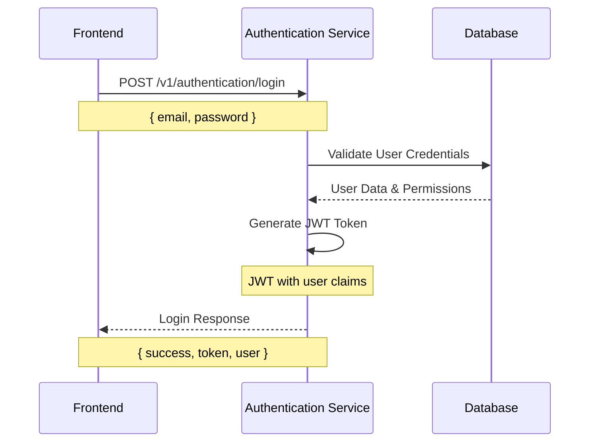
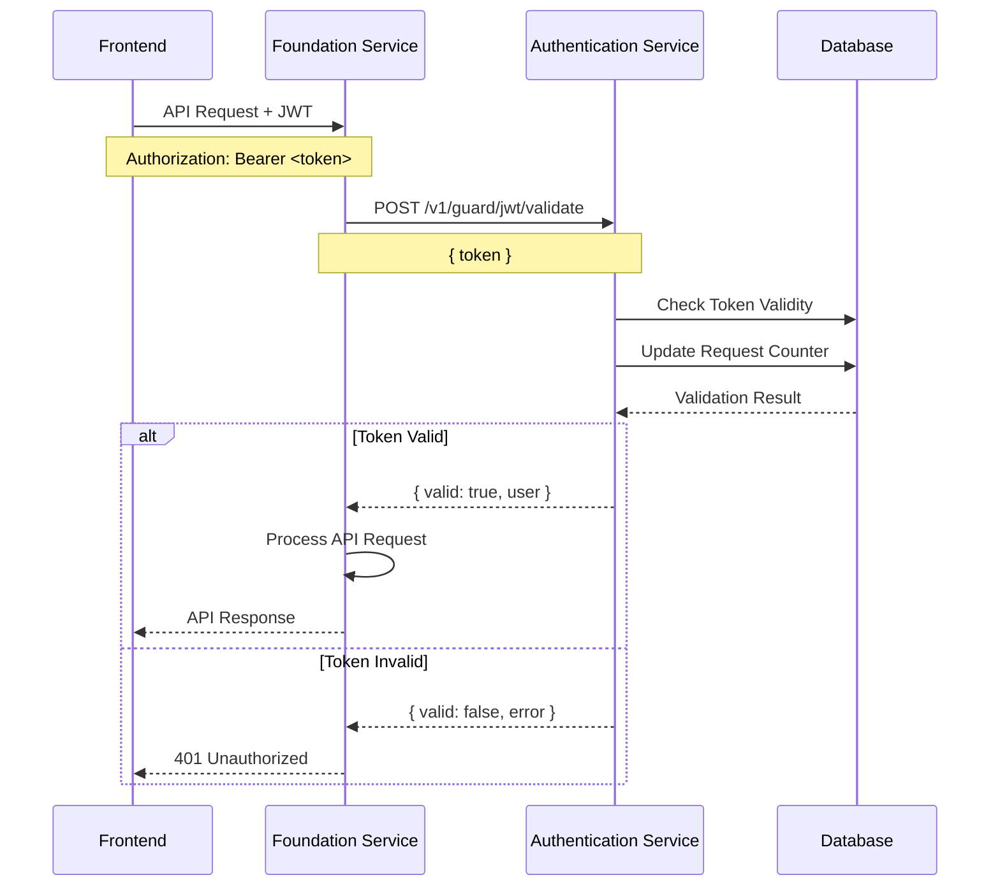
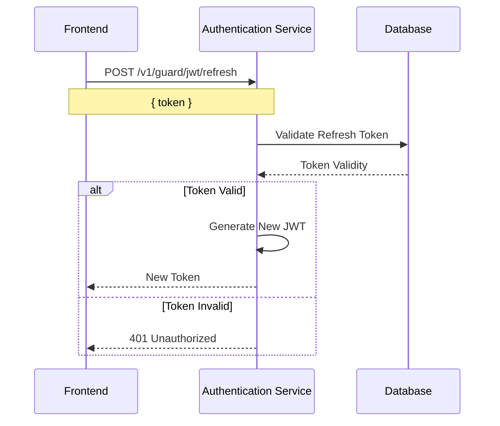
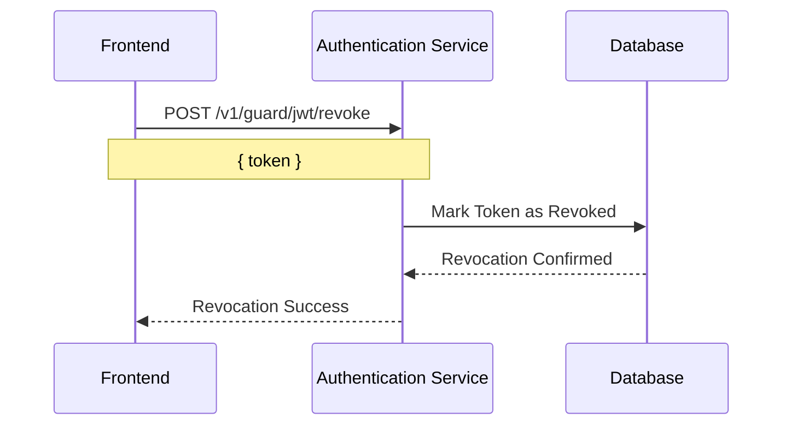
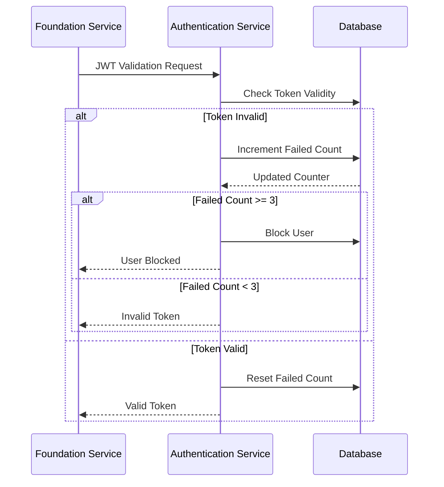
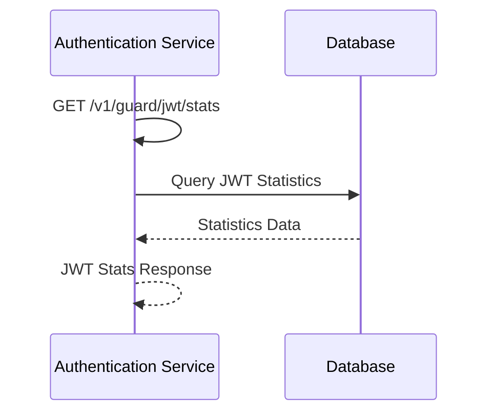
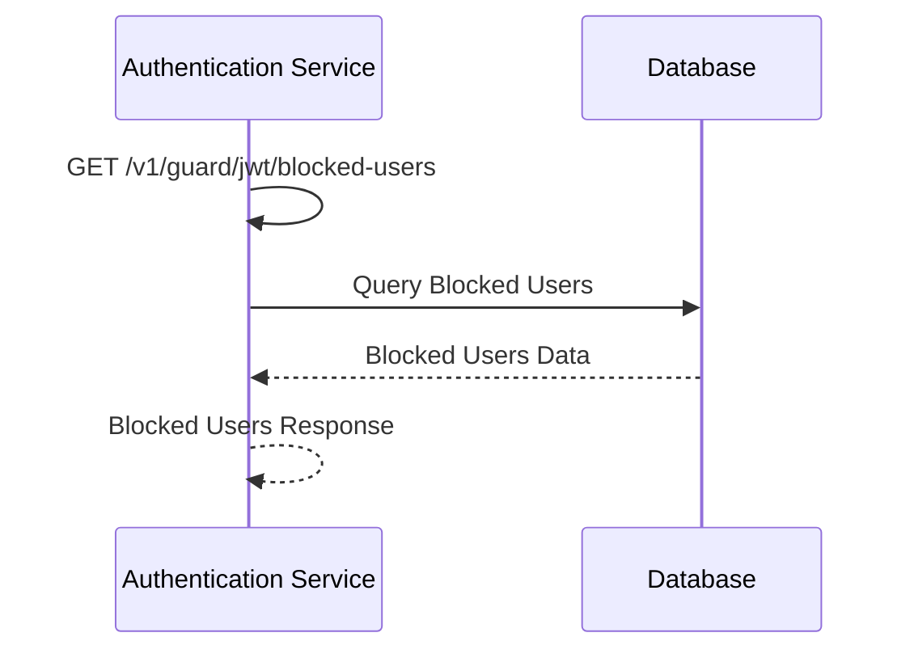
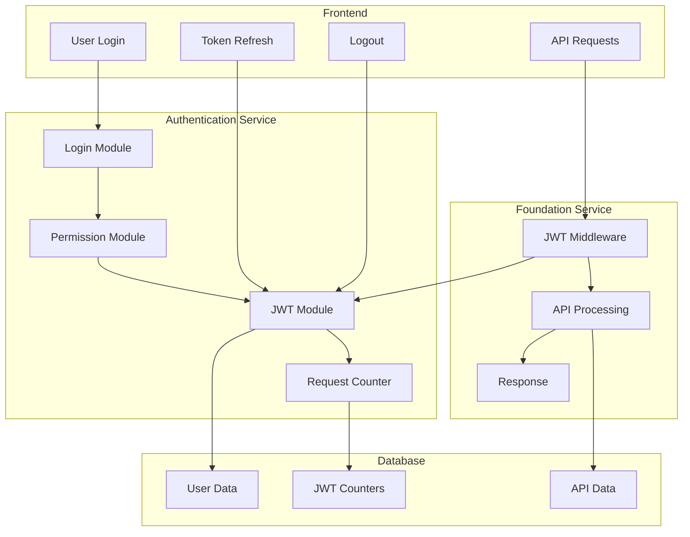

# JWT Authentication System - Workflow

## 🔄 **Complete Authentication Workflow**

This document outlines the complete workflow for the JWT authentication system, including user login, API access, and security operations.

## 🚀 **1. User Login Workflow**

### **Login Process:**


### **Login Endpoint:**
```http
POST https://authentication.keeptrack.velonovo.com/v1/authentication/login
Content-Type: application/json

{
  "email": "user@example.com",
  "password": "userpassword"
}
```

### **Login Response:**
```json
{
  "success": true,
  "message": "Login successful",
  "data": {
    "token": "eyJhbGciOiJIUzI1NiIsInR5cCI6IkpXVCJ9...",
    "user": {
      "id": "user-123",
      "email": "user@example.com",
      "name": "John Doe",
      "permissions": ["read", "write"]
    }
  }
}
```

## 🛡️ **2. API Request Workflow**

### **Protected API Access:**


### **JWT Validation Endpoint:**
```http
POST https://authentication.keeptrack.velonovo.com/v1/guard/jwt/validate
Content-Type: application/json

{
  "token": "eyJhbGciOiJIUzI1NiIsInR5cCI6IkpXVCJ9..."
}
```

### **Validation Response:**
```json
{
  "success": true,
  "valid": true,
  "user": {
    "id": "user-123",
    "email": "user@example.com",
    "permissions": ["read", "write"]
  }
}
```

## 🔄 **3. JWT Refresh Workflow**

### **Token Refresh Process:**


### **Refresh Endpoint:**
```http
POST https://authentication.keeptrack.velonovo.com/v1/guard/jwt/refresh
Content-Type: application/json

{
  "token": "eyJhbGciOiJIUzI1NiIsInR5cCI6IkpXVCJ9..."
}
```

## 🚫 **4. JWT Revocation Workflow**

### **Token Revocation Process:**


### **Revocation Endpoint:**
```http
POST https://authentication.keeptrack.velonovo.com/v1/guard/jwt/revoke
Content-Type: application/json

{
  "token": "eyJhbGciOiJIUzI1NiIsInR5cCI6IkpXVCJ9..."
}
```

## 🔒 **5. Security Workflow**

### **Request Counter System:**


### **User Blocking Logic:**
- **Threshold**: 3 failed JWT validation attempts
- **Blocking**: User blocked for 15 minutes
- **Recovery**: Automatic unblocking after timeout
- **Reset**: Successful validation resets counter

## 📊 **6. Monitoring Workflow**

### **JWT Statistics:**


### **Statistics Endpoint:**
```http
GET https://authentication.keeptrack.velonovo.com/v1/guard/jwt/stats
```

### **Statistics Response:**
```json
{
  "success": true,
  "data": {
    "total_validations": 1250,
    "successful_validations": 1200,
    "failed_validations": 50,
    "blocked_users": 5,
    "active_tokens": 150
  }
}
```

## 🔍 **7. Blocked Users Workflow**

### **Blocked Users Management:**


### **Blocked Users Endpoint:**
```http
GET https://authentication.keeptrack.velonovo.com/v1/guard/jwt/blocked-users
```

### **Blocked Users Response:**
```json
{
  "success": true,
  "data": [
    {
      "user_id": "user-123",
      "failed_count": 3,
      "blocked_until": "2024-01-15T10:30:00Z",
      "last_attempt": "2024-01-15T10:15:00Z"
    }
  ]
}
```

## 🔄 **8. Complete System Workflow**

### **End-to-End Authentication:**


## 🚀 **9. Production Workflow**

### **Production Endpoints:**
- **Authentication Service**: `https://authentication.keeptrack.velonovo.com`
- **Foundation Service**: `https://foundation.keeptrack.velonovo.com`

### **Frontend Integration:**
```javascript
// Login
const loginResponse = await fetch('https://authentication.keeptrack.velonovo.com/v1/authentication/login', {
  method: 'POST',
  headers: { 'Content-Type': 'application/json' },
  body: JSON.stringify({ email, password })
});

const { data } = await loginResponse.json();
const token = data.token;

// API Request
const apiResponse = await fetch('https://foundation.keeptrack.velonovo.com/v1/dashboard/assets', {
  headers: { 'Authorization': `Bearer ${token}` }
});
```

## 🔧 **10. Error Handling Workflow**

### **Common Error Scenarios:**
- **Invalid Credentials**: 401 Unauthorized
- **Invalid Token**: 401 Unauthorized
- **Blocked User**: 403 Forbidden
- **Token Expired**: 401 Unauthorized
- **Server Error**: 500 Internal Server Error

### **Error Response Format:**
```json
{
  "success": false,
  "message": "Authentication failed",
  "error": {
    "code": "INVALID_CREDENTIALS",
    "details": "Invalid email or password"
  }
}
```

## 📈 **11. Performance Workflow**

### **Optimization Strategies:**
- **JWT Validation**: Local validation in Foundation Service
- **Database**: Optimized queries with indexes
- **Caching**: JWT validation results cached
- **Load Balancing**: Multiple service instances

### **Monitoring Metrics:**
- **Response Time**: JWT validation latency
- **Throughput**: Requests per second
- **Error Rate**: Failed authentication percentage
- **Blocked Users**: Security incident tracking