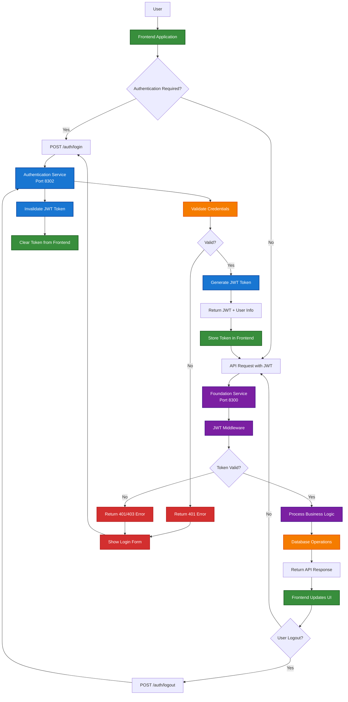
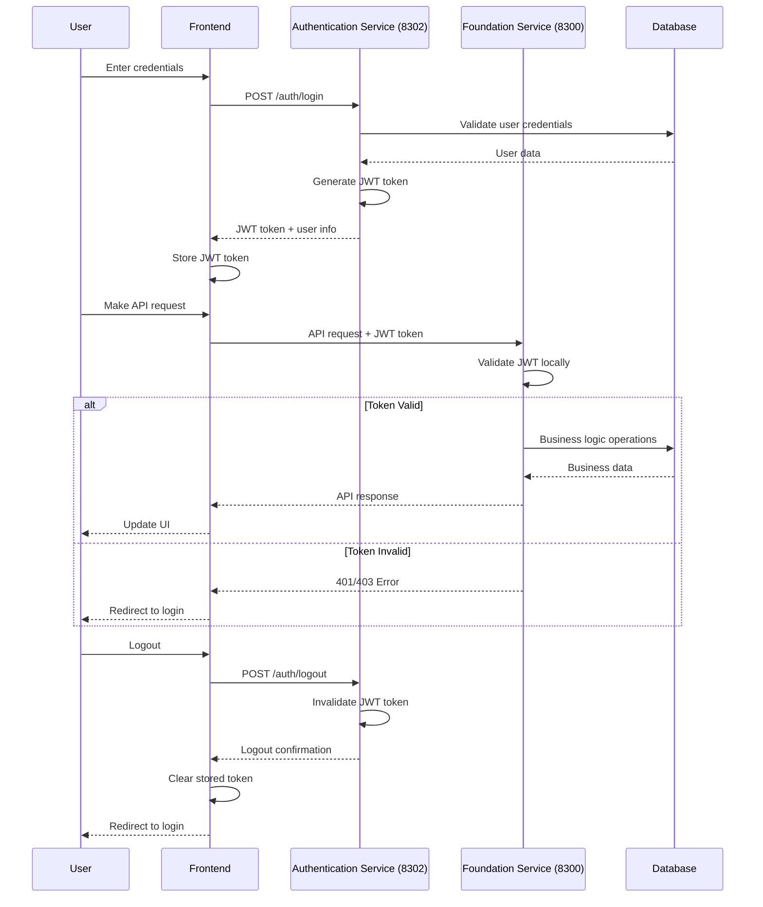
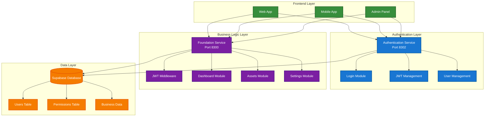
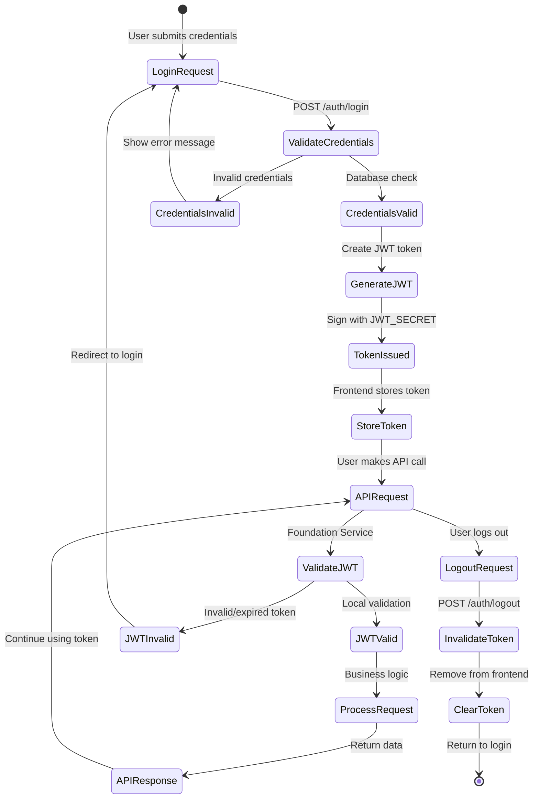
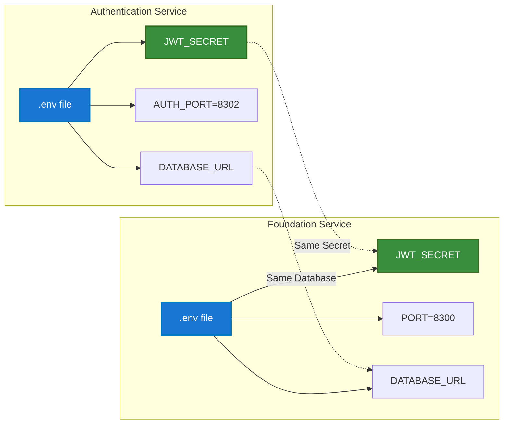
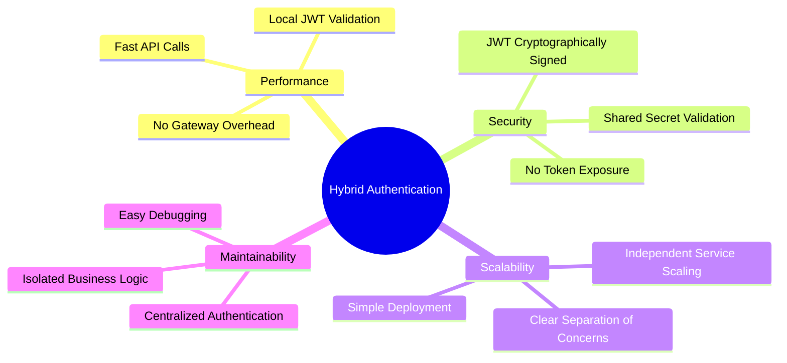

# Authentication Process Flow

## Hybrid Authentication Architecture

## Service Communication Flow

## System Architecture Overview

## JWT Token Lifecycle

## Environment Configuration

## Key Benefits

